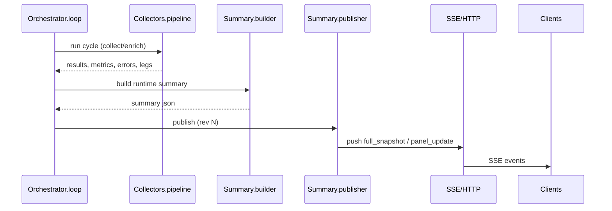

# G6 Project – Comprehensive Overview (2025-10-21)

This document provides a deep, timestamped snapshot of the G6 project's structure, architecture, data/logic flows, configuration surface, and roadmap. It is intended for developers and maintainers.

## Directory structure (high-level)

```
.
├─ src/                         # Core application modules (production code)
│  ├─ orchestrator/             # Main loop, startup sequence, gating, phases
│  ├─ collectors/               # Pipeline & modules for data collection/enrichment
│  ├─ provider/                 # Provider abstraction & integrations
│  ├─ summary/                  # Summary model/builder/publisher + unified SSE
│  ├─ panels/                   # Panel models & helpers (terminal/UI)
│  ├─ metrics/                  # Metrics registry, categories, emission logic
│  ├─ storage/                  # CSV/Influx sinks & retention
│  ├─ web/dashboard/            # Static/dynamic web dashboard bits
│  ├─ utils/                    # Shared utilities (env flags, logging, time)
│  ├─ config/                   # Config loader, schema/validation
│  ├─ validation/               # Preventive validators
│  └─ ... (broker, streaming, ui_enhanced, etc.)
│
├─ scripts/                     # CLI tools, startup helpers, summary panels
│  ├─ summary/                  # Summary UI, panels, SSE helpers, tools
│  │  ├─ panels/                # Panels: alerts, indices, storage, header, system, analytics, ...
│  │  ├─ plugins/               # Panel plugins (SSE, dossier, etc.)
│  │  ├─ sse_*.py / unified_http.py  # SSE and HTTP glue for summary
│  │  └─ ... (builder, schema, resync, metrics_server)
│  ├─ tools/                    # Env snapshot/restore, sanitation utilities
│  ├─ obs_start.ps1             # Launch Prometheus/Grafana stack
│  ├─ grafana_*.ps1             # Grafana environment and restart helpers
│  └─ ... (pytest_run.py, overlay tools, dev utilities)
│
├─ data/                        # Runtime data outputs, overlays, panels cache
├─ docs/                        # Documentation artifacts (if any)
├─ grafana/                     # Grafana provisioning (configs/dashboards)
├─ config/                      # Static configuration templates
├─ tests/                       # Pytest suites
├─ *.md                         # Design docs, change logs, runbooks
├─ prometheus*.yml              # Prometheus config and rules
├─ pyproject.toml, requirements.txt, ruff.toml, mypy.ini, pytest.ini
└─ scripts/tools/env_*.ps1      # Snapshot/restore scripts (see below)
```

## Architecture overview

A modular pipeline orchestrates data collection from providers, enriches it, emits metrics, and produces a consolidated runtime summary that is published via SSE/HTTP and used by terminal/web panels.

```mermaid
flowchart LR
    subgraph Providers
      P1[Broker/Kite API]
      P2[Mock/Async Providers]
    end

    subgraph Collectors
      C0[Pipeline Root]
      C1[Modules (enrichment, validation, expiry, ...)]
    end

    subgraph Orchestrator
      O1[Startup & Phases]
      O2[Loop & Gating]
      O3[Status Writer]
    end

    subgraph Summary
      S1[Model/Builder]
      S2[Publisher]
      S3[SSE/HTTP]
    end

    subgraph Metrics
      M1[Registry]
      M2[Emitters]
      M3[Exporters]
    end

    subgraph Storage
      ST1[CSV Sink]
      ST2[InfluxDB]
    end

    P1 & P2 --> C0 --> C1 --> O2 --> S1 --> S2 --> S3
    C1 --> M2 --> M3
    C1 --> ST1 & ST2
    O1 --> O2
```

### Runtime summary and panels
- The orchestrator loop produces a unified status (runtime summary) each cycle.
- `src/summary` builds/publishes; `scripts/summary/*` renders panels and serves SSE/HTTP for live dashboards.
- Panels (alerts/indices/system/storage/analytics) derive UI rows from the status json and/or panel-specific data sources.

## Key modules and scripts (purpose and interactions)

This is a curated map of the most impactful areas. See inline docstrings and module headers for further details.

### src/orchestrator
- `bootstrap.py`, `startup_sequence.py`: initialize services and phases.
- `loop.py`, `cycle.py`: main loop; schedules collectors, updates status, triggers publishers.
- `gating.py`, `gating_types.py`: runtime gating / feature flags during cycles.
- `status_writer.py`, `panel_diffs.py`: write derived status and compute diffs for downstream consumers.
- Interacts with: collectors, summary, metrics, storage.

### src/collectors
- `pipeline_root.py`, `pipeline/`: define collection flow; orchestrate modules.
- Modules under `modules/` (e.g., `alerts_core.py`, `enrichment.py`, `expiry_*`, `coverage_*`, `metrics_updater.py`): specialized responsibilities per data domain.
- `helpers/`: manipulation of greeks, expiry maps, persist logic, validations, struct events, etc.
- Produces: structured events, enriched legs, success/error signals, and feeds status + metrics.

### src/provider
- Abstractions for market data providers with implementations (e.g., `broker/kite/*`).
- Handles auth, quotes, instruments, rate limiting, and diagnostics.

### src/summary
- `model.py`, `builder.py`: assemble the runtime summary from orchestrator outputs.
- `publisher.py`: push summary to sinks (file, memory cache, SSE) and manage revisions.
- `unified/sse.py`, `sse_client.py`: SSE mechanics.

### src/panels
- Models and helpers for UI layout, integrity checks, and panel definitions used in terminal and web views.

### src/metrics
- `registry.py`, `factory.py`, `emitter.py`: central metrics plumbing.
- Category modules (e.g., `performance.py`, `recovery.py`): domain-focused metric sets.
- Exporters (Prom metrics server) integrate with Prometheus.

### src/storage
- CSV sink and InfluxDB sink; retention policies and connection pooling.

### scripts/summary and panels
- `app.py`: entry point for terminal summary UI.
- `sse_*`, `unified_http.py`: SSE and HTTP endpoints serving the summary stream.
- `panels/*.py`: renderers for alerts, indices, header, system (health), storage/backup, analytics, monitoring; designed to be resilient (centralized error handling).
- `snapshot_builder.py`, `schema.py`, `resync.py`: build/validate snapshot artifacts; re-sync logic.
- `bench_sse.py`, `bench_cycle.py`: load/latency harnesses.

### scripts/tools
- `env_snapshot.ps1`: capture system/env/config/python freeze and light Grafana snapshot.
- `env_restore.ps1`: recreate venv, install deps, and restore configs.
- Others: sanitation, purging, rule generation utilities.

## Representative call flows and interactions

### Summary publication + SSE


### Monitoring panel data sources
- Prefers status.loop values (success_rate, durations) and falls back to last stream panel json for latest cycle/legs.
- Computes memory pressure from env-config thresholds and RSS from `status.resources`.

## Data model and metrics surface

- Runtime status (summary) includes keys like:
  - `loop`: cycle number, durations, success_rate, timestamps
  - `indices` and `indices_detail`: latest LTP, legs, success flags
  - `resources`: cpu, rss
  - `provider`: latency_ms
  - `sinks`: csv, influx, backup metrics
  - `health`: collector/provider/sinks states
- Panels may also read dedicated panel json (e.g., `indices_stream` items) when in panels-json mode.
- Metrics: emitted via `src/metrics/*` and served on the metrics server (see `scripts/metrics_server.py`).
  - Categories include performance, recovery, cache, SLA, resource sampling, etc.
  - See `METRICS_CATALOG.md` for a curated list and `prometheus_rules.yml` for derived rules.

## Configuration: how to set and where

- Python deps: `requirements.txt` (dev tools and lint in `pyproject.toml`)
- Lint/type: `ruff.toml`, `mypy.ini` (incremental strict opt-in)
- Tests: `pytest.ini`
- Prometheus/Grafana:
  - `prometheus.yml`, `prometheus_rules.yml`, `prometheus_alerts.yml`, `alertmanager.yml`
  - Grafana provisioning under `grafana/` and scripts in `scripts/grafana_*.ps1`
- Environment variables:
  - Project flags: see `ENV_FLAGS_TABLES.md` and `scripts/grafana_env_setup.ps1`
  - SSE/API token: `G6_SSE_API_TOKEN`
  - Ports: `G6_SSE_HTTP_PORT` (default 9320), Prometheus target ports listed in tasks/configs
  - Proxies: `HTTP_PROXY`, `HTTPS_PROXY`
- Quick start tasks (VS Code Tasks):
  - Start/Restart Grafana, Start Prometheus, Start metrics servers, Smoke simulations, Pytest runners

## Rationale for current architecture

- Modular collectors and orchestrated phases provide clear separation of concerns and evolution paths.
- Centralized metrics and status publishing enable robust observability and self-diagnosis.
- SSE/HTTP for lightweight, near-real-time UI updates without heavy dependencies.
- Storage sinks (CSV/Influx) decouple persistence and visualization from the collector pipeline.

Advantages:
- Testable, swappable modules; incremental rollout (gating)
- Strong operational visibility (Prom/Grafana + terminal panels)
- Performance-oriented (batching, metrics, panel diffs)

Scope for improvement:
- Consolidate panel JSON and status fields to reduce duplication
- Move to async HTTP stack for higher concurrency (httpx/trio) in SSE path (planned)
- Stronger schema enforcement and contracts across module boundaries
- Introduce a message bus (e.g., Kafka) for horizontal scaling when needed

Alternative architectures to consider:
- Event-sourced pipeline with Kafka + stream processors for scaling beyond a single node
- GRPC-based provider interfaces for typed contracts and backpressure
- A central time-series DB (ClickHouse/Parquet lake) for historical analytics in place of/in addition to Influx

## Objectives and accomplished

- Objective: Real-time options data pipeline with robust metrics and dashboards.
- Achievements:
  - End-to-end pipeline from provider → collectors → summary → SSE panels
  - Comprehensive Prom/Grafana observability + terminal summaries
  - Incremental typing and linting, improved error handling and panel resiliency
  - Tooling: snapshot/restore to ease environment management

## Future enhancements and weak links

- Enhancements:
  - Async SSE server + client harness for high concurrency
  - Unified panel data source abstraction
  - Automated integrity checks between Prom metrics and panel status
  - Pluggable provider registry for multi-exchange support
- Weak links / points of failure:
  - Provider API degradation and rate limits → mitigations: backoff, caching, circuit breakers
  - Memory pressure during peak loads → mitigations: sampling, eviction, batching
  - Panel JSON vs status divergence → mitigations: contract tests and schema checks

---

This document reflects the repository as of 2025-10-21. For operational run-books and step-by-step usage, see the accompanying `USER_GUIDE_2025-10-21.md`.
